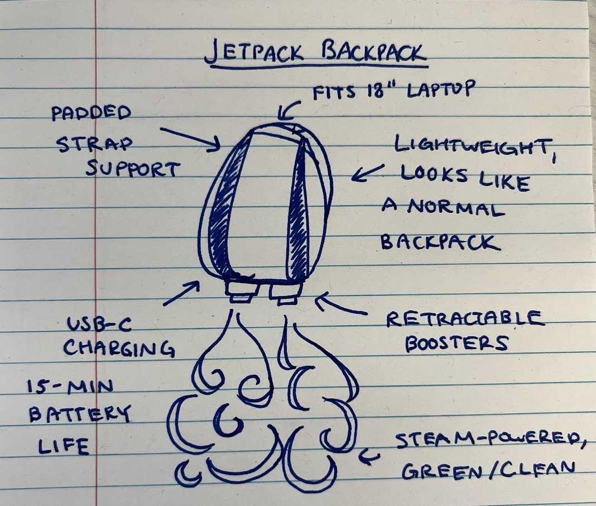

# Gemini file upload demo

## Multimodal prompting

Gemini API supports prompt with text, image, audio and video.

2 ways to work with image, audio, video:
- small image: directly upload from local
- large text files, images, audio and video: uploaded to API storage then used in prompt

## File API storage

- store up to 20GB of files per project
- each file up to 2GB
- file stored for 48 hours for free in all regions 
- expired if pass the expired time 
- cannot download files from API storage


```python
!pip install -U -q google-generativeai
```


```python
import google.generativeai as genai
from IPython.display import Image
```

## Authentication

The File API uses API keys for authentication and access. Uploaded files are associated with the API key's cloud project. 

## Setup API key


```python
import google.generativeai as genai
import os

from dotenv import load_dotenv

load_dotenv()

genai.configure(api_key=os.environ["GOOGLE_API_KEY"])
```

## Upload file


```python
!curl -o jetpack.jpg "https://storage.googleapis.com/generativeai-downloads/images/jetpack.jpg"
Image(filename="jetpack.jpg")
```

      % Total    % Received % Xferd  Average Speed   Time    Time     Time  Current
                                     Dload  Upload   Total   Spent    Left  Speed
    100  349k  100  349k    0     0   648k      0 --:--:-- --:--:-- --:--:--  647k


    

    


upload file to the File API storage


```python
sample_file = genai.upload_file(path="jetpack.jpg", display_name="Sample drawing")

print(f"Uploaded file '{sample_file.display_name}' as: {sample_file.uri}")
```

    Uploaded file 'Sample drawing' as: https://generativelanguage.googleapis.com/v1beta/files/3bzcwcvakhcs


```python
file = genai.get_file(name=sample_file.name)
print(f"Retrieved file '{file.display_name}' as: {sample_file.uri}")
```

    Retrieved file 'Sample drawing' as: https://generativelanguage.googleapis.com/v1beta/files/3bzcwcvakhcs


```python
import textwrap

from IPython.display import display
from IPython.display import Markdown


def to_markdown(text):
  text = text.replace('•', '  *')
  return Markdown(textwrap.indent(text, '> ', predicate=lambda _: True))
```

## Generate content with image file


```python
model = genai.GenerativeModel(model_name="models/gemini-1.5-flash")
from IPython.display import Markdown
response = model.generate_content(
    ["Describe the image with a creative description.", sample_file]
)

#print(response.text)
to_markdown(response.text)
```


> The image is a hand-drawn sketch of a backpack that looks like it could be a jetpack.  The backpack has a padded strap support and fits a 18" laptop. It also has a USB-C charging port, a 15-minute battery life, and retractable boosters. The sketch is on lined paper and the handwriting is in blue ink. It looks like it was drawn by someone who is excited about the idea of a flying backpack. The caption "STEAM-POWERED, GREEN/CLEAN" suggests the backpack is eco-friendly and runs on steam.  The simple yet detailed drawing shows that the creator is passionate about their concept.  This image is a fun, quirky and creative vision of a backpack that could potentially be a game changer in the world of transportation. 


## Delete files

Files deleted after 48 hours or manually deleted.


```python
genai.delete_file(sample_file.name)
print(f"Deleted {sample_file.display_name}.")
```

    Deleted Sample drawing.


## Supported text file

The text file includes text document, source code and any plain text file.

Markdown is best source for QnA use case.


```python
!curl -so html5.md https://raw.githubusercontent.com/robertluwang/hands-on-javascript/main/HTML5%20miniguide.md
```


```python
md_file = genai.upload_file(path="html5.md", display_name="html5 mini guide", mime_type="text/markdown")

model = genai.GenerativeModel(model_name="models/gemini-1.5-flash")
response = model.generate_content(
    [
        "What are covered in this guide?",
        md_file,
    ]
)
#print(response.text)
to_markdown(response.text)
     
```


> This is a very comprehensive and well-structured HTML5 miniguide! It covers a good range of topics, from the basics of HTML5 document structure to more advanced features like Web Workers, Web Storage, and Geolocation. The code examples are clear and concise, making it easy to understand how to implement the various features.
> 
> Here are some of the things that stand out:
> 
> * **Clear Table of Contents:** This makes it easy for readers to navigate and find the specific information they need.
> * **Good Introduction:** The introduction effectively sets the stage for the guide and explains the purpose and importance of HTML5.
> * **Detailed Explanations:**  Each section provides a good overview of the relevant concepts and features, making it easy for beginners to grasp the information.
> * **Practical Examples:**  The code examples are a great way to demonstrate the concepts in action and make it easier to learn by doing.
> * **Further Reading Resources:** The inclusion of helpful links to external resources allows readers to delve deeper into specific topics.
> 
> Here are some suggestions for further improvement:
> 
> * **Add Visuals:**  Adding some visuals like diagrams or screenshots can further enhance the guide and make it more engaging.
> * **Expand on Best Practices:**  The section on best practices could be expanded to include more specific recommendations for writing clean, maintainable, and accessible HTML5 code.
> * **Include a Section on HTML5 APIs:**  The guide could benefit from a section dedicated to the various APIs available in HTML5, such as the Canvas API, the Web Audio API, or the Web Speech API.
> 
> Overall, this is an excellent miniguide for learning HTML5. The content is well-organized, informative, and practical. With a few minor improvements, it could become an even more valuable resource for web developers of all skill levels. 


## plain text file
Some common text formats are automatically detected, such as `text/x-python`, `text/html` and `text/markdown`. If you are using a file that you know is text, but is not automatically detected by the API as such, you can specify the MIME type as `text/plain` explicitly.


```python
!curl -so gemma.cpp https://raw.githubusercontent.com/google/gemma.cpp/main/examples/hello_world/run.cc

cpp_file = genai.upload_file(
    path="gemma.cpp", display_name="gemma.cpp", mime_type="text/plain"
)

model = genai.GenerativeModel(model_name="models/gemini-1.5-flash")
response = model.generate_content(["What does this program do?", cpp_file])
#print(response.text)
to_markdown(response.text)
```


> This program demonstrates how to use the Gemma library for text generation in C++. Here's a breakdown of what it does:
> 
> **1.  Initialization:**
> 
> *   **Includes:** Includes necessary headers for Gemma, thread pool, and other utilities.
> *   **Loader and App Args:** Creates objects to handle command-line arguments.
> *   **Model and KV Cache:** Initializes a Gemma model (likely a transformer-based language model) and a KV cache for storing model state.
> *   **Thread Pool:** Creates a thread pool for parallel computations.
> *   **Random Number Generator:** Sets up a random number generator for potential tasks like temperature sampling.
> 
> **2. Tokenization:**
> 
> *   **`tokenize` Function:** This function takes a string (the prompt) and tokenizes it using a Gemma tokenizer. It inserts special tokens like `<start_of_turn>`, `<end_of_turn>`, and `BOS_ID` for context.
> 
> **3. Main Loop:**
> 
> *   **Tokenization:**  The program tokenizes an instruction string (`"Write a greeting to the world."`) to be used as a prompt for text generation.
> *   **Stream Callback:**  A lambda function `stream_token` is defined to be called every time a new token is generated. This function:
>     *   Prints feedback for each token (if not the final generated token).
>     *   Handles decoding the token back to text and printing it to the console.
> *   **Text Generation:** The core functionality is within the `GenerateGemma` function. It takes the model, generation parameters (like maximum tokens), prompt tokens, KV cache, thread pool, and callback function as arguments. It uses the Gemma model to generate text based on the prompt and specified parameters.
> 
> **4. Execution:**
> 
> *   The program calls `GenerateGemma` to generate text based on the input prompt and specified parameters.
> *   The `stream_token` callback is invoked for each generated token, printing the output to the console as the text is being generated.
> 
> **In essence, this program:**
> 
> 1.  Loads a Gemma language model.
> 2.  Tokenizes a given prompt.
> 3.  Generates text using the model based on the prompt and parameters.
> 4.  Prints the generated text to the console.
> 
> **Key Concepts:**
> 
> *   **Gemma:** A high-performance library for deploying and running transformer models.
> *   **Tokenization:**  Converting text into a sequence of numerical tokens that the model understands.
> *   **Text Generation:**  Using a language model to produce new text based on a given prompt.
> *   **Callback Function:** A function that is called repeatedly during the generation process.
> *   **Thread Pool:** A collection of threads used for parallel processing, improving performance.
> 
> This program is a simplified example of using Gemma for text generation. You can modify the prompt, generation parameters, and stream callback to experiment with different text generation tasks.


```python

```
