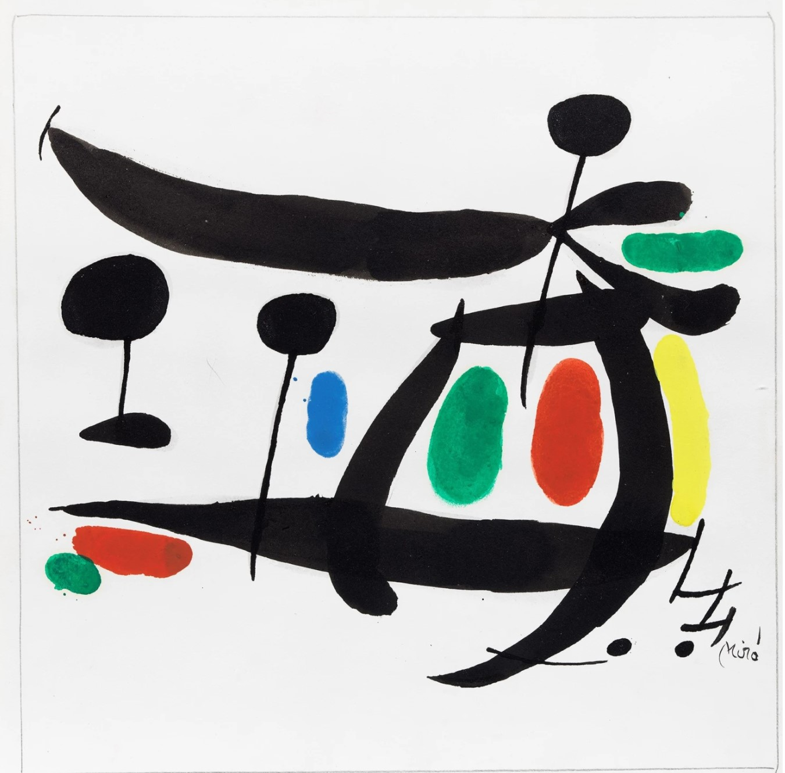

## Setup API key


```python
import google.generativeai as genai
import os

from dotenv import load_dotenv

load_dotenv()

genai.configure(api_key=os.environ["GOOGLE_API_KEY"])

model = genai.GenerativeModel('gemini-1.5-flash')

```

    The history saving thread hit an unexpected error (OperationalError('attempt to write a readonly database')).History will not be written to the database.


```python
prompt = "Write a story about a magic backpack."

response = model.generate_content(prompt)

print(response.text)
```

    Elara had always been a dreamer. While other children played with dolls and trucks, she spent her days weaving fantastical stories in her head, sketching imaginary creatures, and longing for adventure. But life in the dusty, forgotten town of Whispering Pines offered little in the way of excitement. Until the day her grandmother gave her a dusty, leather backpack, its straps worn thin with age.
    
    "This," her grandmother said, eyes twinkling, "was your grandfather's. It holds magic, Elara. But be careful, child. It only reveals its secrets to those with a heart full of wonder."
    
    Elara, captivated, took the backpack. It felt strangely warm in her hands, a familiar weight despite its age. She carried it everywhere, even to the dusty library, where she spent her days lost in the worlds of books. One afternoon, while engrossed in a story about a courageous knight, she reached into the backpack. Her hand brushed against something smooth and cold.
    
    Inside, nestled against the worn fabric, was a shimmering, silver compass. Its needle spun wildly, then pointed towards the window, where a faint, shimmering portal had materialized. Elara’s heart pounded. Could this be real?
    
    With a deep breath, she stepped through the portal, the backpack slung across her shoulders. The world on the other side was breathtaking. Lush green forests stretched out before her, sunlight filtering through leaves, creating patterns on the mossy ground. A crystal-clear river gurgled nearby, its water sparkling like a million tiny diamonds.
    
    Elara, awestruck, started walking. The backpack felt lighter than it should, and soon she discovered why. Every time she needed it, the backpack would magically produce whatever she needed: a sturdy walking stick, a warm blanket against the evening chill, even a delicious meal that tasted like home.
    
    She explored the forest, befriending talking squirrels and mischievous fairies. She helped a grumpy troll recover his lost treasure, earning his gratitude and a beautiful, enchanted flower that bloomed with every wish she whispered.
    
    Then, one day, she stumbled upon a dark, swirling vortex, the source of a growing darkness that threatened the magical forest. The compass, normally a beacon of hope, spun frantically, its needle pointing towards the vortex. Elara knew she had to act.
    
    She reached into the backpack, and this time, it produced a shining sword, its handle warm to the touch. Elara, a girl who had never held a weapon, felt a surge of confidence. The sword felt like an extension of her own will, its blade humming with power.
    
    She fought the darkness, using her bravery and the magical sword, her heart pounding with each swing. Finally, with a burst of light, she banished the darkness, bringing peace back to the forest.
    
    Elara returned to Whispering Pines, the backpack still heavy with memories. She had seen magic, faced her fears, and learned the true meaning of wonder. Though she returned to her ordinary life, she knew the backpack would always be there, a reminder that the world held endless possibilities for those who dared to dream.
    
    From that day forward, Elara wasn’t just a girl with a dusty backpack. She was a girl with a heart full of wonder, ready to face whatever adventures the world threw her way, knowing that somewhere, within the folds of that old leather, magic waited, ready to be unveiled. 
    


## Generate text using combined text and image 


```python
import pathlib
import PIL.Image

image1 = {
    'mime_type': 'image/jpeg',
    'data': pathlib.Path('image1.jpg').read_bytes()
}

img1 = PIL.Image.open('image1.jpg')
img1
```


    

    


```python
image2 = {
    'mime_type': 'image/jpeg',
    'data': pathlib.Path('image2.jpg').read_bytes()
}

img2 = PIL.Image.open('image2.jpg')
img2
```


    

    


```python
prompt = "What's different between these pictures?"

response = model.generate_content([prompt, image1, image2])
print(response.text)
```

    The first picture is an abstract painting by Joan Miró. It is composed of black lines and shapes, with a few spots of color. The second picture is a depiction of a nude woman, painted by Henri Matisse. It is made up of a single color, blue, and uses simple shapes to represent the figure.


## Text streaming


```python
prompt = "Write a story about a magic backpack."

response = model.generate_content(prompt, stream=True)

for chunk in response:
  print(chunk.text)
  print("_"*80)
```

    The
    ________________________________________________________________________________
     old, worn leather backpack had always been a source of fascination for twelve-year
    ________________________________________________________________________________
    -old Finn. Found tucked away in his grandmother's attic, it had
    ________________________________________________________________________________
     a strange, almost magnetic pull. He'd tried to decipher its cryptic stitching, the worn leather, the faint scent of sea salt and woodsmoke that clung
    ________________________________________________________________________________
     to it. 
    
    One rainy afternoon, with boredom gnawing at him, Finn decided to take the backpack on a walk through the woods behind his house.
    ________________________________________________________________________________
     He slung it over his shoulder, the leather surprisingly soft against his skin. As he walked, he felt a prickling sensation on his back, followed by a strange tingling in his fingertips. Suddenly, a flash of blue light erupted from
    ________________________________________________________________________________
     the backpack, leaving a wisp of smoke in its wake.
    
    Finn was startled, but he couldn't help but be drawn to the backpack. He reached inside, his hand sinking into a soft, warm space. He pulled out
    ________________________________________________________________________________
     a book, its pages filled with swirling script in an unknown language. He flipped through the pages, mesmerized by the intricate patterns. 
    
    “This is a book of spells,” a voice whispered behind him.
    
    Finn spun around, his heart pounding. He saw a small, shimmering creature, about the size of
    ________________________________________________________________________________
     a hummingbird, with iridescent wings and eyes like polished sapphires. 
    
    "Who are you?" Finn asked, his voice trembling.
    
    "I am Skye," the creature replied, her voice like tinkling bells. "And this backpack is a magical artifact. It contains spells and wonders, but only those with a
    ________________________________________________________________________________
     pure heart can use them."
    
    Finn's eyes widened. "What kind of spells?"
    
    "Spells to heal, to protect, to create," Skye said, fluttering closer. "This backpack chooses its wielder, and it has chosen you, Finn."
    
    That night, Finn learned the first spell from Skye
    ________________________________________________________________________________
    . It was a simple spell to make flowers bloom in the middle of winter. He held the book close, whispered the words, and watched in awe as a single rose bud bloomed on a bare branch in his garden. 
    
    The backpack became Finn's secret, a source of wonder and magic. He learned
    ________________________________________________________________________________
     to conjure shimmering butterflies, to mend broken toys, and even to speak to the animals in the forest. He shared his magic with others, helping a friend mend his broken bike, making a shy classmate blossom with confidence.
    
    One day, a dark shadow fell upon their town. A wicked sorcerer, known only as the
    ________________________________________________________________________________
     Raven, threatened to engulf the world in darkness. The town was terrified, their hopes dwindling with each passing day. 
    
    Finn, with Skye perched on his shoulder, knew he had to do something. He gathered his courage and faced the Raven, using his newfound magic to protect his town and banish the darkness. He
    ________________________________________________________________________________
     learned that true magic wasn't about power, but about using it to help others.
    
    From that day on, Finn became known as the Boy with the Magic Backpack, a protector of the innocent and a symbol of hope. The backpack, once a source of curiosity, became a symbol of his bravery, his compassion
    ________________________________________________________________________________
    , and the magic that resided within him. And he knew, with every bloom, every butterfly, every whispered spell, that the magic wouldn't ever leave him, as long as he kept his heart pure. 
    
    ________________________________________________________________________________


## chat


```python
import os
import google.generativeai as genai

from dotenv import load_dotenv

load_dotenv()

genai.configure(api_key=os.environ['GOOGLE_API_KEY'])

model = genai.GenerativeModel('gemini-1.5-flash')
chat = model.start_chat(history=[])

response = chat.send_message(
    'In one sentence, explain how a smart phone works to a young child.')

print(response.text)

response = chat.send_message(
    'Okay, how about a more detailed explanation to a high schooler?')

print(response.text)
```

    A smartphone is like a little computer in your hand that lets you talk to people, play games, and learn new things! 
    
    A smartphone is essentially a mini-computer with a touchscreen interface that combines the functions of a phone, a camera, a music player, and a web browser, allowing you to access information, communicate with others, and be entertained all in one device. 
    


## Configration


```python
model = genai.GenerativeModel(
    'gemini-1.5-flash',
    generation_config=genai.GenerationConfig(
        max_output_tokens=2000,
        temperature=0.9,
    ))
```


```python
response = model.generate_content(
    'Write a story about a magic backpack.',
    generation_config = genai.GenerationConfig(
        max_output_tokens=1000,
        temperature=0.1,
    )
)
```


```python
print(response.text)
```

    Elara, a girl with eyes the color of storm clouds and hair like spun moonlight, had always felt different. While other children played with dolls and toy cars, she dreamt of faraway lands and whispered secrets to the wind. One day, while exploring the dusty attic of her grandmother's house, she stumbled upon a peculiar backpack tucked away in a forgotten corner. It was made of worn leather, its straps adorned with intricate silver embroidery. A faint, sweet scent of cinnamon and pine needles emanated from it.
    
    Elara, drawn by an inexplicable pull, unzipped the backpack. Inside, nestled amongst a layer of soft, moss-green velvet, lay a single, shimmering feather. It pulsed with a soft, golden light, and as Elara touched it, a voice, as old as time itself, whispered in her ear, "Welcome, traveler. This is your passport to adventure."
    
    From that day on, Elara's life was never the same. The backpack, imbued with ancient magic, became her constant companion. It held within its depths a world of possibilities. A simple wish whispered into the feather would conjure anything Elara desired. A warm blanket on a cold night, a delicious meal when hunger gnawed at her stomach, even a book filled with stories of faraway lands.
    
    One day, Elara found herself yearning for the vast, blue ocean. She whispered her desire to the feather, and the backpack unzipped, revealing a shimmering, turquoise portal. Stepping through, she found herself on the deck of a magnificent sailing ship, the salty air whipping through her hair. She spent days exploring the ocean, befriending dolphins and learning the secrets of the sea from wise old sailors.
    
    But Elara soon realized that the magic backpack wasn't just about fulfilling her desires. It was about experiencing the world, learning, and growing. She used the backpack to travel to bustling cities, climb snow-capped mountains, and even visit the moonlit forests of a mythical land. With each adventure, Elara's spirit soared, her heart filled with wonder and a deep understanding of the world around her.
    
    One day, while exploring a forgotten library in a distant city, Elara discovered a book about a powerful, ancient magic that could heal the world. The book spoke of a hidden spring, its waters imbued with the power to mend broken hearts and heal the earth. Elara knew she had to find it.
    
    With the help of the backpack, she journeyed across continents, following cryptic clues and facing perilous challenges. Finally, she reached a hidden valley, where the spring glistened like a diamond under the sun. Elara, with a heart full of hope, dipped her hands into the water and felt its healing power flow through her.
    
    From that day on, Elara used the magic backpack not just for personal adventures, but to help others. She used the backpack to bring food to starving villages, to heal the sick, and to spread joy and laughter wherever she went. The backpack, once a symbol of personal desires, became a beacon of hope and a testament to the power of kindness and compassion.
    
    Elara, the girl with storm cloud eyes and moonlight hair, became known throughout the land as the "Traveler of Wonders," a legend whispered on the wind, a symbol of the magic that lies within us all, waiting to be discovered. And the magic backpack, forever bound to her, became a reminder that the greatest adventures are not about what we get, but about what we give. 
    


```python

```
